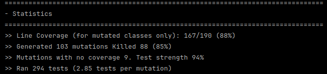
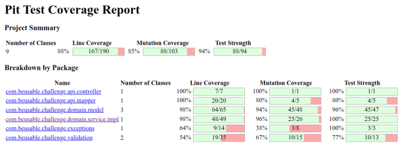

# Hotel Room Allocation Service

This project provides a hotel occupancy solution that allocates rooms to guests based on their offers.   

It was designed with best practices, scalability, and extensibility in mind. While certain aspects of the solution may seem a bit over-engineered for the specified task, they were implemented intentionally, to ensure future-proofing and easy maintenance.

---

## tl;dr How to build and run

### 1. Locally (Java 21+ required)

The application can be built and run directly from the repository using the provided `run.sh` script.

```sh
./run.sh
```

### 2. In Docker Container
- #### with buildx
```sh
docker buildx build -t piotr-beusable-challenge . && docker run --name piotr-beusable-challenge -p 8080:8080 piotr-beusable-challenge
```
- #### or a standard docker build
```sh
docker build -t piotr-beusable-challenge . && docker run --name piotr-beusable-challenge -p 8080:8080 piotr-beusable-challenge
```
These will build the application in a container and expose it on port `8080`.

#### Stop with 
```sh
docker stop piotr-beusable-challenge
```
### 3. Testing (+ mutation tests)
You can run unit tests via the `run_tests.sh` 

```sh
./run_tests.sh
```
or unit + mutation tests with `run_mutation_tests.sh` to generate the test repost:
```sh
./run_mutation_tests.sh
```
The high line and mutation coverage percentages in the mutation tests report indicate, that the tests I wrote are quite strong overall, especially for the controller, mapper, and the service implementation.  
The service tests are proven to be well-designed and thorough, with a 100% mutation coverage ensuring that all introduced faults were caught effectively.  

  
For a more detailed analysis, please refer to [/target/pit-reports/index.html](/target/pit-reports/index.html) after running script above

### 4. REST API Usage
There's only one endpoint: `POST /occupancy` available at `localhost:8080`.  
The Swagger UI page available here: http://localhost:8080/swagger-ui/index.html#/Occupancy%20Management/calculateOccupancy
#### Example payload:

```json
{
  "premiumRooms": 7,
  "economyRooms": 5,
  "potentialGuests": [200.0, 150.0, 50.0, 10.0, 300.0]
}
```
#### Example response:

```json
{
  "usagePremium": 6,
  "revenuePremium": 1054.00,
  "usageEconomy": 4,
  "revenueEconomy": 189.00
}
```

#### Example Error Response:
The field name will be an `error` (e.g. in case of failed validation)

```json
{
  "error": "field `premiumRooms` must be greater than or equal to 0"
}
```
---
## Design Considerations

### 1. Assumptions

- **Positive Offers Only**: Initially, I considered adding a configuration property like `hotel.min.threshold` (e.g., in the `application.properties` set to `0` by default) to be able to further filter guest offers, but I eventually decided it would be an overkill since the existing design already provides sufficient flexibility.

Therefore, the system only accepts **positive** offers (assuming that the hotel would not give away rooms for free).

### 2. Clear separation of layers
I aimed to keep all the layers: **API, Service, Domain, Validation, and Exception Handling** separated for easier maintenance.


### 3. Extensibility
The solution was designed to be easily extensible. Possible changes, such as:

- adding new `RoomType` (e.g., `DELUXE`),
- extending the `Guest` model to include more attributes (e.g., `gender`, `age`),
- extending the `Room` model to include more attributes (e.g., `hasJacuzzi`),
- extending the response with the currency and custom formatting (see `CurrencyConfig` and `currencies.properties`)
- implementing new service with custom sorting logic in case of a changed business request (e.g., always assigning `DELUXE` rooms with a Jacuzzi to women) by overriding the `sortGuests` in `GuestAllocatorService` interface

can be easily introduced without altering the core application.

### 4. Custom Multi-Layer Validation Logic
The application includes multiple layers of validation to ensure that data is validated at both the controller (custom `@ValidDoubleArray` with `DoubleArrayValidator)`  and domain levels (`OccupancyValidator`).

### 5. Custom `Money` Class
To ensure that monetary values are handled consistently across the application, simplifying the logic for calculating revenue and preventing issues with floating-point precision.

### 6. Custom Exceptions with clear HTTP error responses
Achieved with `HotelContextException`, `RoomAllocationException` and `GlobalExceptionsHandler`.

